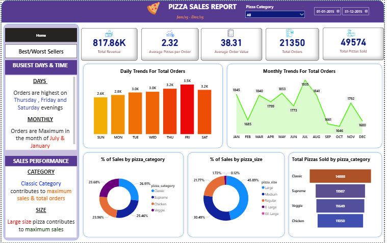

# Domino's Pizza Sales Analysis

## Project Overview
This project analyzes Domino's pizza sales data to uncover key business insights related to revenue, order trends, and product performance.

The analysis was performed using SQL for data extraction and Power BI for dashboard visualization.

## Tools Used
- SQL Server
- Power BI
- Excel
- Kaggle Dataset

## Business Questions Answered
- What are the best-selling pizzas?
- Which days generate the highest sales?
- What pizza categories contribute the most revenue?
- What are the worst-performing pizzas?

## Key Insights
• Total Revenue: $817K+  
• Peak Sales Days: Thursday, Friday, Saturday  
• Classic Category contributes the highest sales  
• Large-size pizzas generate maximum revenue  

## Dashboard Features
- KPI Cards (Revenue, Orders, AOV)
- Sales Trends by Day
- Sales by Pizza Category
- Top & Bottom Performing Pizzas
- Interactive slicers

## Dashboard Preview

## Dataset
The dataset was sourced from Kaggle and contains order-level sales transactions.

## Author
Kesar Deaulkar

