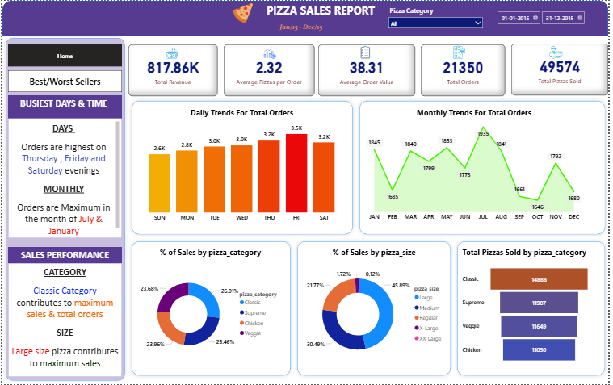
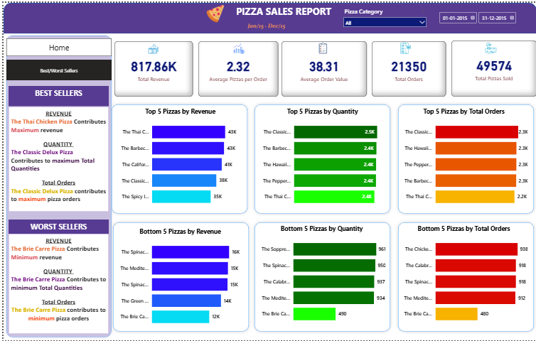

# 🍕 Domino’s Sales Analysis: Revenue Optimization & Demand Insights

## 📌 Project Overview
This project analyzes Domino’s pizza sales data to identify key revenue drivers, understand customer demand patterns, and uncover opportunities to improve business performance.

The objective is not just to visualize data, but to derive actionable insights that can support strategic decision-making.

---

## 🛠 Tools & Technologies
- SQL Server (Data analysis)
- Power BI (Dashboard visualization)
- Excel (Data source)

---

## 📊 Key Business Questions
- Which pizza categories and sizes drive the most revenue?
- Are top-selling pizzas also the most profitable?
- How do sales vary across days and time periods?
- What factors contribute to peak and low-demand periods?

---

## 📈 Key Insights
- Sales peak during lunch hours (12–1 PM), indicating strong demand during this period  
- Evening hours show high order volume but lower average order value, suggesting upselling opportunities  
- Large-size pizzas contribute the highest revenue, showing customer preference for larger orders  
- Sales increase towards the end of the week, peaking on Friday, indicating weekend-driven demand  
- A few pizzas dominate revenue, indicating dependency on top-performing products  

---

## 💡 Business Recommendations
- Introduce combo offers during evening hours to increase average order value  
- Launch promotions on low-demand days (e.g., Sunday) to improve consistency  
- Promote mid-performing pizzas to reduce dependency on top products  
- Focus marketing campaigns around peak demand hours to maximize revenue  

---

## 📊 Dashboard Features
- KPI Cards (Revenue, Orders, Average Order Value)
- Sales trends by day and hour
- Revenue by pizza category and size
- Top & bottom performing pizzas
- Interactive filters for dynamic analysis  

---

## 📊 Dashboard Preview

---

## 📂 Dataset
The dataset was sourced from Kaggle and contains order-level transaction data.

---

## 👤 Author
Kesar Deaulkar
